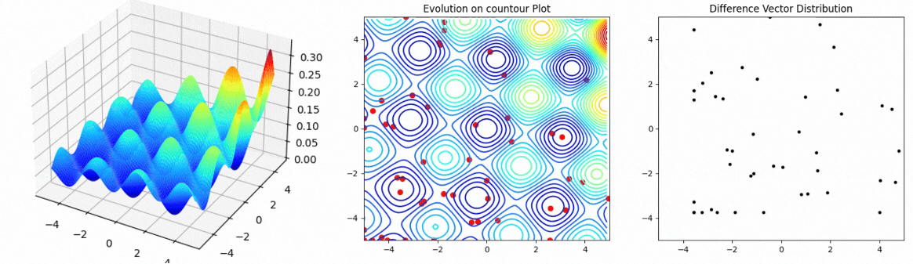

# Fundamental-of-Evolutionary-Computation
This repository provides a simple implementation of Genetic Algorithms (GA), Differential Evolution (DE), and Particle Swarm Optimization (PSO) for minimizing various benchmark functions. 
The details of these algorithms are documented in the```Fundamental_Evolutionary_Algorithm.pdf``` file.



# Usage 
First, clone this repository and install the [DEAP](https://github.com/DEAP/deap) library to use its benchmark functions as the fitness function.


```cmd
pip install deap
cd script
```

Then, run the following command to execute the evolutionary algorithm, or use the notebook located in the ```notebook``` directory.

```cmd
python main.py [--function_name FUNCTION] \\ Choices: {"cigar", "sphere", "ackley", "bohachevsky", "h1", "himmelblau", "rastrigin"}.
                 [--pop_size POP_SIZE]
                 [--F F_VALUE] 
                 [--CR CR_VALUE] 
                 [--max_iter MAX_ITER] 
                 [--visualize VISUALIZE] 
                 [--algorithm ALGORITHM] \\ Choices: {"GA", "DE", "PSO"}
```

